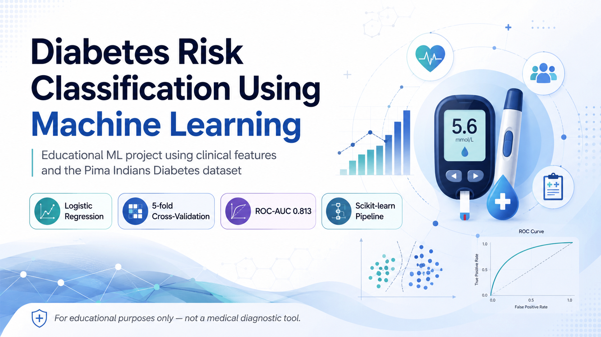
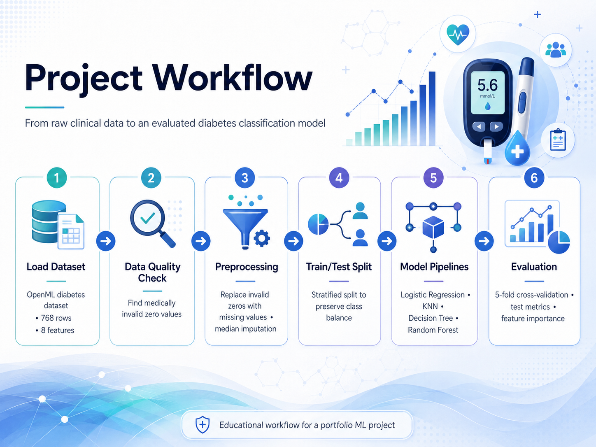
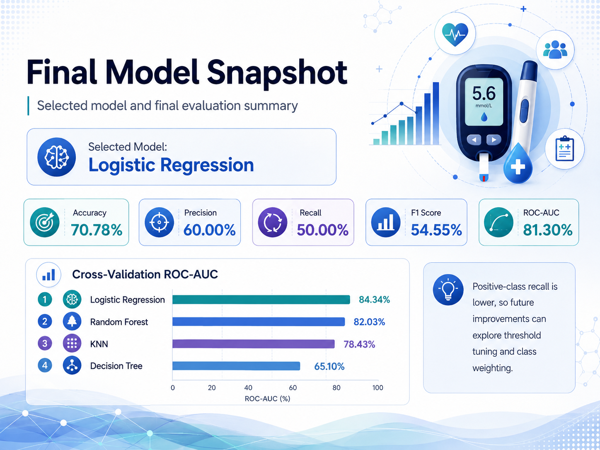

<p align="center">
  
</p>

<h1 align="center">Diabetes Risk Classification Using Machine Learning</h1>

<p align="center">
  An end-to-end machine learning classification project using clinical features,
  leakage-safe preprocessing pipelines, stratified cross-validation, and model interpretation.
</p>

<p align="center">
  
  
  
  
  
  
</p>

---

## Overview

This project develops a complete machine learning workflow for classifying
diabetes outcomes using clinical measurements from the Pima Indians Diabetes dataset.

The project goes beyond basic model training by focusing on:

- hidden data-quality issues,
- leakage-safe preprocessing,
- reusable Scikit-learn pipelines,
- stratified train-test splitting,
- cross-validation-based model selection,
- multiple evaluation metrics,
- permutation feature importance,
- and trained-model persistence.

> **Disclaimer:** This project is intended only for educational and portfolio
> purposes. It is not a medical diagnostic system and must not be used for
> clinical decision-making.

---

## Project Workflow

<p align="center">
  
</p>

The workflow includes:

1. Loading the dataset from OpenML
2. Inspecting data types and distributions
3. Detecting medically invalid zero values
4. Replacing invalid zeros with missing values
5. Applying median imputation inside model pipelines
6. Creating a stratified train-test split
7. Comparing multiple classification algorithms
8. Selecting the best model using cross-validation ROC-AUC
9. Evaluating the final model on an untouched test set
10. Interpreting feature importance
11. Saving the complete trained pipeline

---

## Dataset

The project uses the Pima Indians Diabetes dataset obtained through OpenML.

### Dataset dimensions

- 768 observations
- 8 clinical input features
- 1 binary outcome variable

### Features

| Feature | Description |
|---|---|
| `pregnancies` | Number of pregnancies |
| `glucose` | Plasma glucose concentration |
| `blood_pressure` | Diastolic blood pressure |
| `skin_thickness` | Triceps skin-fold thickness |
| `insulin` | Two-hour serum insulin |
| `bmi` | Body mass index |
| `diabetes_pedigree` | Diabetes pedigree function |
| `age` | Age in years |
| `outcome` | Negative or positive diabetes outcome |

---

## Data Quality Handling

A standard missing-value check initially reports no missing values.

However, several medical measurements contain zero values that are unlikely
to represent valid physiological measurements.

The following columns are treated as containing hidden missing values:

- `glucose`
- `blood_pressure`
- `skin_thickness`
- `insulin`
- `bmi`

These invalid zero values are converted to `NaN`.

Median imputation is then applied inside each Scikit-learn pipeline so that
the imputation values are learned only from training data. This prevents
information leakage from the test set.

---

## Models Compared

The following classification algorithms were evaluated:

- Logistic Regression
- K-Nearest Neighbors
- Decision Tree
- Random Forest

Logistic Regression and KNN use:

- median imputation,
- standard scaling,
- and model training.

Decision Tree and Random Forest use:

- median imputation,
- and model training.

Tree-based models do not require feature scaling.

---

## Evaluation Strategy

Models were compared using five-fold stratified cross-validation on the
training set.

The following metrics were evaluated:

| Metric | Purpose |
|---|---|
| Accuracy | Overall proportion of correct predictions |
| Precision | Reliability of positive predictions |
| Recall | Proportion of actual positive cases detected |
| F1-score | Balance between precision and recall |
| ROC-AUC | Ability to rank positive cases above negative cases |

ROC-AUC was used as the primary model-selection metric.

---

## Cross-Validation Results

| Model | Accuracy | Precision | Recall | F1-score | ROC-AUC |
|---|---:|---:|---:|---:|---:|
| Logistic Regression | 0.7882 | 0.7638 | 0.5748 | 0.6545 | **0.8434** |
| Random Forest | 0.7720 | 0.7082 | **0.6029** | 0.6495 | 0.8203 |
| KNN | 0.7296 | 0.6367 | 0.5654 | 0.5939 | 0.7843 |
| Decision Tree | 0.6726 | 0.5306 | 0.5795 | 0.5519 | 0.6510 |

Logistic Regression achieved the highest cross-validation ROC-AUC and was
selected as the final model.

---

## Final Model Performance

<p align="center">
  
</p>

The selected Logistic Regression model was evaluated on the untouched test set.

| Metric | Test score |
|---|---:|
| Accuracy | 70.78% |
| Precision | 60.00% |
| Recall | 50.00% |
| F1-score | 54.55% |
| ROC-AUC | **81.30%** |

The ROC-AUC score indicates reasonably good class-separation ability.

However, the positive-class recall of 50% means that the default probability
threshold detects only half of the actual positive observations.

---

## Model Interpretation

Permutation feature importance was used to estimate how strongly each feature
contributed to the selected model's predictive performance.

A larger decrease in ROC-AUC after shuffling a feature indicates that the
model relies more heavily on that feature.

Feature importance represents predictive association and must not be interpreted
as proof of medical causation.

---

## Repository Structure

```text
diabetes-prediction-ml/
│
├── assets/
│   ├── project_banner.png
│   ├── project_workflow.png
│   └── final_model_snapshot.png
│
├── diabetes_prediction_ml.ipynb
├── diabetes_prediction_model.joblib
├── README.md
├── requirements.txt
├── .gitignore
└── LICENSE
